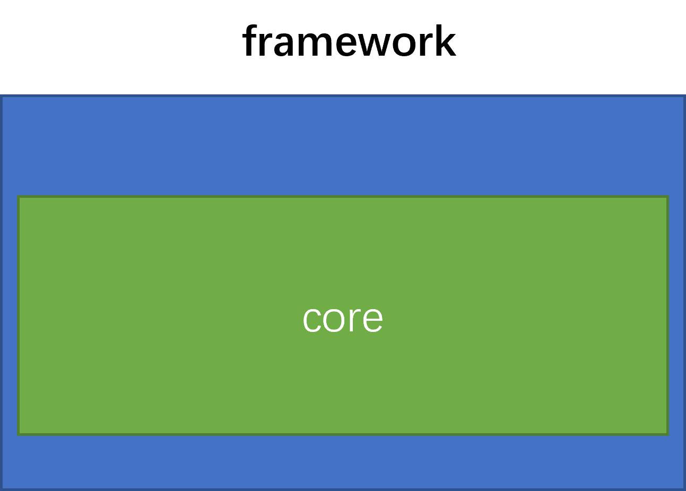
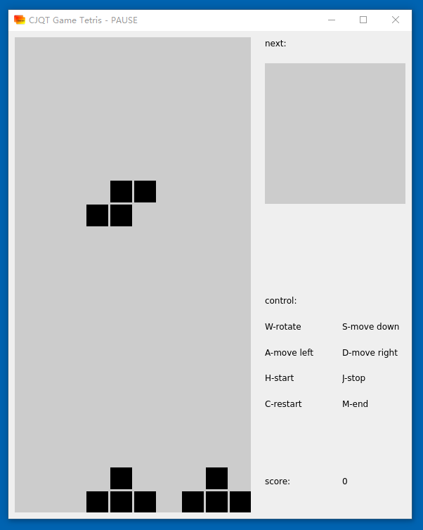
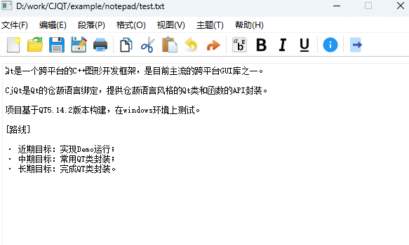
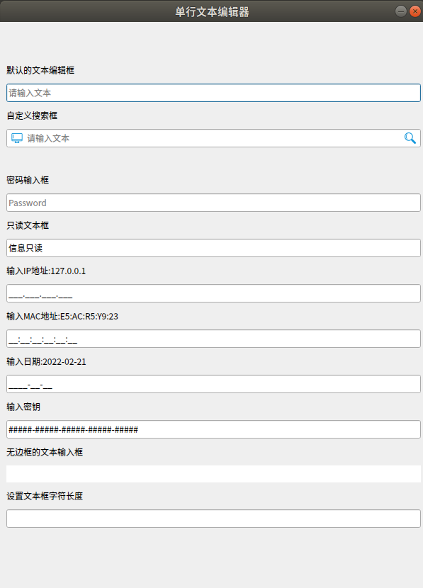

<p align="center">

</p>

<p align="center">


</p>


## 介绍

Qt是一个跨平台的C++图形开发框架，是目前主流的跨平台GUI库之一。

CjQt是Qt的仓颉语言绑定，提供仓颉语言风格的Qt类和函数的API封装。

项目基于QT5.14.2版本构建，在wsl2+Ubuntu20.04上测试

### 路线

- 近期目标：实现Demo运行，实现俄罗斯方块游戏
- 中期目标：常用QT类封装
- 长期目标：完成QT类封装，结合领域eDSL实现声明式UI框架

<p align="center">

</p>

### 当前进度

- [QWidgets封装进度](./doc/qt_widgets.md)
- [QCore封装进度](./doc/qt_core.md)
- [QGui封装进度](./doc/qt_gui.md)


##     软件架构

### 架构图

<p align="center">

</p>

### 源码目录

```shell
.
├── README.md
├── doc
│   ├── assets     
│   ├── design.md  
│   ├── proposal.md
│   └── xxx_lib.md 
├── example
│   ├── draw
│   ├── feeluown
│   ├── frame
│   ├── hello
│   └── lineEdit
│   ├── notepad
│   ├── scrollBar
│   └── tetris
├── native
│   ├── src
│   │   ├── core
│   │   ├── gui
│   │   └── widgets
│   └── CMakeLists.txt
├── src
│   ├── qt
│   │   ├── core
│   │   ├── gui
│   │   └── widgets
│   └── main.cj
└── test   
    ├── HLT
    ├── LLT
    └── UT
```

- `doc`是库的设计文档、提案、库的使用文档
- `example`是cjqt项目的使用示例
- `native`是C语言绑定QT库源码目录
- `src`是库源码目录
- `test`是存放测试用例，包括HLT用例、LLT 用例和UT用例

## 编译执行

### 接口说明

cjqt类和成员函数说明，详情见 [API](./doc/api/index.html)

### 安装依赖

安装 libxkbcommon-x11
```shell
sudo apt-get install libxkbcommon-x11-0
```

### hello示例

[hello示例详情](./example/hello)

执行命令：

Linux下：

```shell
./example/hello/run.sh 
```

Windows下：

```shell
.\example\hello\run.ps1 
```

执行效果：

<p align="center">

</p>


### 俄罗斯方块游戏示例

[俄罗斯方块示例详情](./example/tetris)


执行命令：

```shell
./example/tetris/run.sh
```

执行效果：

<p align="center">

</p>

### 记事本示例

[记事本示例详情](./example/notepad)

执行命令：

```shell
./example/notepad/run.sh
```

执行效果：

<p align="center">

</p>

### 单行文本编辑器使用示例

[单行文本编辑器使用示例详情](./example/lineEdit)

执行命令：

```shell
./example/lineEdit/run.sh
```

执行效果：

<p align="center">

</p>

### QFrame使用示例

[QFrame使用示例详情](./example/frame)

执行命令：

```shell
./example/frame/run.sh
```

执行效果：

<p align="center">

</p>

### 项目使用（源码引用方式）

克隆cjqt项目到本地
```shell
https://gitee.com/HW-PLLab/qt.git
```

创建demo项目并初始化工程
```shell
mkdir demo && cd demo
cpm new demo demo
```

修改module.json文件并引入cjqt
`path` 为qt的项目路径
```json
{
  "cjc_version": "0.30.4",
  "organization": "demo",
  "name": "demo",
  "description": "nothing here",
  "version": "1.0.0",
  "requires": {
    "cjqt": {
      "organization": "cangjie",
      "version": "0.0.1",
      "path": "../qt"
    }
  },
  "package_requires": {},
  "foreign_requires": {},
  "output_type": "executable",
  "command_option": "",
  "cross_compile_configuration": {}
}
```

更新项目
```shell
cpm update
```

新建src/main.cj文件
```cangjie
import cjqt.widgets.*

main() {
    QApplication.create()
    
    let win = QMainWindow()
    win.setWindowTitle("CJQT Demo")
    win.resize(400, 300)
    win.show()

    QApplication.exec()

    win.delete()
    QApplication.delete()
}
```

编译与运行
```shell
export LD_LIBRARY_PATH=../qt/native/lib:${LD_LIBRARY_PATH}
export LD_LIBRARY_PATH=../qt/build/cjqt:${LD_LIBRARY_PATH}
export QT_QPA_PLATFORM_PLUGIN_PATH=../qt/native/lib/platforms
./../qt/build.sh
cpm build
./bin/main
```

### 项目编译

下载QT文件[qt-opensource-linux-x64-5.14.2.run](https://download.qt.io/archive/qt/5.14/5.14.2/)到安装目录


安装 QT
```shell
chmod +x qt-opensource-linux-x64-5.14.2.run
./qt-opensource-linux-x64-5.14.2.run
```

配置环境变量
```shell
vim ~/.bashrc
export QT_HOME=/home/wathinst/Qt5.14.2/5.14.2/gcc_64(自己的安装目录)
source ~/.bashrc
```

编译项目源码

```shell
./build_native.sh  
./build.sh
```

## 参与贡献

主要写参与贡献的人以及个人主页链接

[@Chinesebear](https://gitee.com/chinesebear) [@wathinst](https://gitee.com/wathinst) [@helin4576](https://gitee.com/helin4576)
