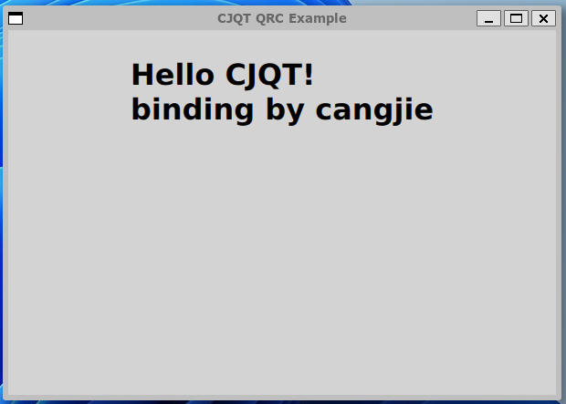

<p align="center">

</p>

<p align="center">


</p>


## 介绍

Qt是一个跨平台的C++图形开发框架，是目前主流的跨平台GUI库之一。

CjQt是Qt的仓颉语言绑定，提供仓颉语言风格的Qt类和函数的API封装。

### 路线

<p align="center">

</p>

### 当前进度

```
QWidgets:

QAbstractButton           ░░░░░░░░░░         QAbstractGraphicsShapeItem   ░░░░░░░░░░
QAbstractItemDelegate     ░░░░░░░░░░         QAbstractItemView            ░░░░░░░░░░    
QAbstractScrollArea       ░░░░░░░░░░         QAbstractSlider              ░░░░░░░░░░    
QAbstractSpinBox          ░░░░░░░░░░         QAccessibleWidget            ░░░░░░░░░░
QAction                   ░░░░░░░░░░         QActionGroup                 ░░░░░░░░░░
QApplication              ▓░░░░░░░░░         QBoxLayout                   ░░░░░░░░░░
QButtonGroup              ░░░░░░░░░░         QCalendarWidget              ░░░░░░░░░░
QCheckBox                 ░░░░░░░░░░         QColorDialog                 ░░░░░░░░░░
QColormap                 ░░░░░░░░░░         QColumnView                  ░░░░░░░░░░
QComboBox                 ░░░░░░░░░░         QCommandLinkButton           ░░░░░░░░░░
QCommonStyle              ░░░░░░░░░░         QDateEdit                    ░░░░░░░░░░
QDateTimeEdit             ░░░░░░░░░░         QDial                        ░░░░░░░░░░
QDialog                   ░░░░░░░░░░         QDialogButtonBox             ░░░░░░░░░░
QDockWidget               ░░░░░░░░░░         QDoubleSpinBox               ░░░░░░░░░░
QErrorMessage             ░░░░░░░░░░         QFileDialog                  ░░░░░░░░░░
QFileIconProvider         ░░░░░░░░░░         QFileSystemModel             ░░░░░░░░░░
QFocusFrame               ░░░░░░░░░░         QFontComboBox                ░░░░░░░░░░
QFontDialog               ░░░░░░░░░░         QFormLayout                  ░░░░░░░░░░
QFrame                    ░░░░░░░░░░         QGesture                     ░░░░░░░░░░
QGestureEvent             ░░░░░░░░░░         QGestureRecognizer           ░░░░░░░░░░
QGraphicsAnchor           ░░░░░░░░░░         QGraphicsAnchorLayout        ░░░░░░░░░░
QGraphicsBlur             ░░░░░░░░░░         QGraphicsColorizeEffect      ░░░░░░░░░░
QGraphicsDropShadowEffect ░░░░░░░░░░         QGraphicsEffect              ░░░░░░░░░░
QGraphicsEllipseItem      ░░░░░░░░░░         QGraphicsGridLayout          ░░░░░░░░░░
QGraphicsItem             ░░░░░░░░░░         QGraphicsItemGroup           ░░░░░░░░░░
QGraphicsLayout           ░░░░░░░░░░         QGraphicsLayoutItem          ░░░░░░░░░░
QGraphicsLineItem         ░░░░░░░░░░         QGraphicsLinearLayout        ░░░░░░░░░░
QGraphicsObject           ░░░░░░░░░░         QGraphicsOpacityEffect       ░░░░░░░░░░
QGraphicsPathItem         ░░░░░░░░░░         QGraphicsPixmapItem          ░░░░░░░░░░
QGraphicsPolygonItem      ░░░░░░░░░░         QGraphicsProxyWidget         ░░░░░░░░░░
QGraphicsRectItem         ░░░░░░░░░░         QGraphicsRotation            ░░░░░░░░░░
QGraphicsScale            ░░░░░░░░░░         QGraphicsScene               ░░░░░░░░░░
QGraphicsSceneContextMenuEvent ░░░░░░░░░░    QGraphicsSceneDragDropEvent  ░░░░░░░░░░
QGraphicsSceneEvent       ░░░░░░░░░░         QGraphicsSceneHelpEvent      ░░░░░░░░░░
QGraphicsSceneHoverEvent  ░░░░░░░░░░         QGraphicsSceneMouseEvent     ░░░░░░░░░░
QGraphicsSceneMoveEvent   ░░░░░░░░░░         QGraphicsSceneResizeEvent    ░░░░░░░░░░
QGraphicsSceneWheelEvent  ░░░░░░░░░░         QGraphicsSceneWheelEvent     ░░░░░░░░░░
QGraphicsTextItem         ░░░░░░░░░░         QGraphicsTransform           ░░░░░░░░░░
QGraphicsView             ░░░░░░░░░░         QGraphicsWidget              ░░░░░░░░░░
QGridLayout               ░░░░░░░░░░         QGroupBox                    ░░░░░░░░░░
QHBoxLayout               ░░░░░░░░░░         QHeaderView                  ░░░░░░░░░░
QInputDialog              ░░░░░░░░░░         QItemDelegate                ░░░░░░░░░░
QItemEditorCreator        ░░░░░░░░░░         QItemEditorCreatorBase       ░░░░░░░░░░
QItemEditorFactory        ░░░░░░░░░░         QKeyEventTransition          ░░░░░░░░░░
QKeySequenceEdit          ░░░░░░░░░░         QLCDNumber                   ░░░░░░░░░░
QLabel                    ░░░░░░░░░░         QLayout                      ░░░░░░░░░░
QLayoutItem               ░░░░░░░░░░         QLineEdit                    ░░░░░░░░░░
QListView                 ░░░░░░░░░░         QListWidget                  ░░░░░░░░░░
QListWidgetItem           ░░░░░░░░░░         QMainWindow                  ▓░░░░░░░░░
QMdiArea                  ░░░░░░░░░░         QMdiSubWindow                ░░░░░░░░░░
QMenu                     ░░░░░░░░░░         QMenuBar                     ░░░░░░░░░░
QMessageBox               ░░░░░░░░░░         QMouseEventTransition        ░░░░░░░░░░
QOpenGLWidget             ░░░░░░░░░░         QPanGesture                  ░░░░░░░░░░
QPinchGesture             ░░░░░░░░░░         QPlainTextDocumentLayout     ░░░░░░░░░░
QPlainTextEdit            ░░░░░░░░░░         QProgressBar                 ░░░░░░░░░░
QProgressDialog           ░░░░░░░░░░         QProxyStyle                  ░░░░░░░░░░
QPushButton               ░░░░░░░░░░         QRadioButton                 ░░░░░░░░░░
QRubberBand               ░░░░░░░░░░         QScrollArea                  ░░░░░░░░░░
QScrollBar                ░░░░░░░░░░         QScroller                    ░░░░░░░░░░
QScrollerProperties       ░░░░░░░░░░         QShortcut                    ░░░░░░░░░░
QSizeGrip                 ░░░░░░░░░░         QSizePolicy                  ░░░░░░░░░░
QSlider                   ░░░░░░░░░░         QSpacerItem                  ░░░░░░░░░░
QSpinBox                  ░░░░░░░░░░         QSplashScreen                ░░░░░░░░░░
QSplitter                 ░░░░░░░░░░         QSplitterHandle              ░░░░░░░░░░
QStackedLayout            ░░░░░░░░░░         QStackedWidget               ░░░░░░░░░░
QStandardItemEditorCreator ░░░░░░░░░░        QStatusBar                   ░░░░░░░░░░
QStyle                    ░░░░░░░░░░         QStyleFactory                ░░░░░░░░░░
QStyleHintReturn          ░░░░░░░░░░         QStyleHintReturnMask         ░░░░░░░░░░
QStyleHintReturnVariant   ░░░░░░░░░░         QStyleOption                 ░░░░░░░░░░
QStyleOptionButton        ░░░░░░░░░░         QStyleOptionComboBox         ░░░░░░░░░░
QStyleOptionComplex       ░░░░░░░░░░         QStyleOptionDockWidget       ░░░░░░░░░░
QStyleOptionFocusRect     ░░░░░░░░░░         QStyleOptionFrame            ░░░░░░░░░░
QStyleOptionGraphicsItem  ░░░░░░░░░░         QStyleOptionGroupBox         ░░░░░░░░░░
QStyleOptionHeader        ░░░░░░░░░░         QStyleOptionMenuItem         ░░░░░░░░░░
QStyleOptionProgressBar   ░░░░░░░░░░         QStyleOptionRubberBand       ░░░░░░░░░░
QStyleOptionSizeGrip      ░░░░░░░░░░         QStyleOptionSlider           ░░░░░░░░░░
QStyleOptionSpinBox       ░░░░░░░░░░         QStyleOptionTab              ░░░░░░░░░░
QStyleOptionTabBarBase    ░░░░░░░░░░         QStyleOptionTabWidgetFrame   ░░░░░░░░░░
QStyleOptionTitleBar      ░░░░░░░░░░         QStyleOptionToolBar          ░░░░░░░░░░
QStyleOptionToolBox       ░░░░░░░░░░         QStyleOptionToolButton       ░░░░░░░░░░
QStyleOptionViewItem      ░░░░░░░░░░         QStylePainter                ░░░░░░░░░░
QStylePlugin              ░░░░░░░░░░         QStyledItemDelegate          ░░░░░░░░░░
QSwipeGesture             ░░░░░░░░░░         QSystemTrayIcon              ░░░░░░░░░░
QTabBar                   ░░░░░░░░░░         QTabWidget                   ░░░░░░░░░░
QTableView                ░░░░░░░░░░         QTableWidget                 ░░░░░░░░░░
QTableWidgetItem          ░░░░░░░░░░         QTableWidgetSelectionRange   ░░░░░░░░░░
QTapAndHoldGesture        ░░░░░░░░░░         QTapGesture                  ░░░░░░░░░░
QTextBrowser              ░░░░░░░░░░         QTextEdit                    ░░░░░░░░░░
QTileRules                ░░░░░░░░░░         QTimeEdit                    ░░░░░░░░░░
QToolBar                  ░░░░░░░░░░         QToolBox                     ░░░░░░░░░░
QToolButton               ░░░░░░░░░░         QToolTip                     ░░░░░░░░░░
QTreeView                 ░░░░░░░░░░         QTreeWidget                  ░░░░░░░░░░
QTreeWidgetItem           ░░░░░░░░░░         QTreeWidgetItemIterator      ░░░░░░░░░░
QUndoCommand              ░░░░░░░░░░         QUndoGroup                   ░░░░░░░░░░
QUndoStack                ░░░░░░░░░░         QUndoView                    ░░░░░░░░░░
QVBoxLayout               ░░░░░░░░░░         QWhatsThis                   ░░░░░░░░░░
QWidget                   ▓░░░░░░░░░         QWidgetAction                ░░░░░░░░░░
QWidgetItem               ░░░░░░░░░░         QWizard                      ░░░░░░░░░░
QWizardPage               ░░░░░░░░░░

QCode:

QBuffer                   ░░░░░░░░░░         QChar                        ░░░░░░░░░░
QDate                     ░░░░░░░░░░         QDateTime                    ░░░░░░░░░░
QDir                      ░░░░░░░░░░         QEvent                       ░░░░░░░░░░
QEventLoop                ░░░░░░░░░░         QFile                        ░░░░░░░░░░

QGui:

QBitmap                   ░░░░░░░░░░         QCloseEvent                  ░░░░░░░░░░
QColor                    ░░░░░░░░░░         QFocusEvent                  ░░░░░░░░░░
QFont                     ░░░░░░░░░░         QIcon                        ░░░░░░░░░░
QImage                    ░░░░░░░░░░         QKeyEvent                    ▓▓▓▓▓▓░░░░
QMouseEvent               ▓▓▓▓▓▓▓░░░         QPaintEvent                  ▓▓▓▓▓▓░░░░

```


##     软件架构

### 架构图

<p align="center">

</p>

### 源码目录

```shell
.
├── README.md
├── doc
│   ├── assets     
│   ├── design.md  
│   ├── proposal.md
│   └── xxx_lib.md 
├── native
│   ├── src
│   │   ├── application.cpp
│   │   ├── main_window.cpp
│   │   ├── url.cpp
│   │   └── qml_application_engine.cpp
│   └── CMakeLists.txt
├── src
│   ├── qt
│   │   ├── q_application.cj
│   │   ├── q_qml_application_engine.cj
│   │   └── q_url.cj
│   └── main.cj
└── test   
    ├── HLT
    ├── LLT
    └── UT
```

- `doc`是库的设计文档、提案、库的使用文档
- `native`是C语言绑定QT库源码目录
- `src`是库源码目录
- `test`是存放测试用例，包括HLT用例、LLT 用例和UT用例

## 编译执行

### 编译

编译描述和具体shell命令

```shell
./native.make.sh
cpm update
cpm build
```

### Qt5示例

创建main.cj文件
```cangjie
import qt.*

main() {
    let app = QApplication()
    let win = QMainWindow()
    win.resize(300, 200)
    win.show()
    app.exec()
    win.delete()
    app.delete()
}
```

执行命令如下：

```shell
./run.sh
```

执行效果：

<p align="center">

</p>

### QML示例

创建hello.qml文件

```qml
import QtQuick 2.2
import QtQuick.Controls 1.4

ApplicationWindow {
    id: app
    title: "CJQT QRC Example"
    width: 600; height: 400
    color: "lightgray"
    Component.onCompleted: visible = true

    Text {
        text: "Hello CJQT!\nbinding by cangjie"
        y: 30
        anchors.horizontalCenter: app.contentItem.horizontalCenter
        font.pointSize: 24; font.bold: true
    }
}
```
创建main.cj文件
```cangjie
import qt.*

main() {
    let app = QApplication()
    let engine = QQmlApplicationAngine()
    engine.loadUrl("./src/hello.qml")
    app.exec()
    engine.delete()
    app.delete()
}
```

执行命令如下：

```shell
./run.sh
```

执行效果：

<p align="center">

</p>

## 参与贡献

主要写参与贡献的人以及个人主页链接

[@chinesebear](https://gitee.com/chinesebear) [@wathinst](https://gitee.com/wathinst)

<style>
 
.container {
  width: 30%;
  background-color: #888888;
}
 
.skills {
  text-align: right;
  padding-right: 12px;
  line-height: 20px;
  color: white;
  background-color: #2196F3;
}

</style>