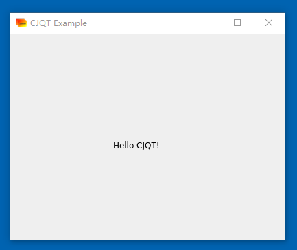

### hello示例

创建main.cj文件
```cangjie
import cjqt.qt.widgets.*
import cjqt.qt.gui.*

main() {
    QApplication.create()
    let win = QMainWindow()
    win.setWindowTitle("CJQT示例")
    win.resize(400, 300)

    let label = QLabel(win)
    label.setGeometry(120, 20, 200, 40)
    label.setText("Hello CJQT!")
    label.setFontSize(24)
    label.setFontColor(QColor.Red)

    let button = QPushButton(win)
    button.setGeometry(150, 80, 100, 24)
    button.setText("按钮")
    button.clicked.connect() {
        QMessageBox.information(win, "消息提示", "点击事件!")
    }

    let group = QGroupBox(parent: win)
    group.setTitle("单选框")
    group.setGeometry(50, 130, 100, 60)

    let layout = QHBoxLayout()
    layout.addWidget(QRadioButton(text: "甲"))
    layout.addWidget(QRadioButton(text: "乙"))

    group.setLayout(layout)

    let group1 = QGroupBox(parent: win)
    group1.setTitle("复选框")
    group1.setGeometry(220, 130, 100, 60)

    let layout1 = QHBoxLayout()
    layout1.addWidget(QCheckBox(text: "丙"))
    layout1.addWidget(QCheckBox(text: "丁"))

    group1.setLayout(layout1)

    win.show()

    QApplication.exec()

    win.delete()
    QApplication.delete()
}
```

执行命令如下：

```shell
cd `cjqtPath` # cjqt源码路径
./build.sh

cd `path` # 项目路径
cpm update
cpm build

export LD_LIBRARY_PATH=`cjqtPath`/native/build:${LD_LIBRARY_PATH}  # 添加cjqt native动态库路径

./bin/main
```

执行效果：

<p align="center">

</p>